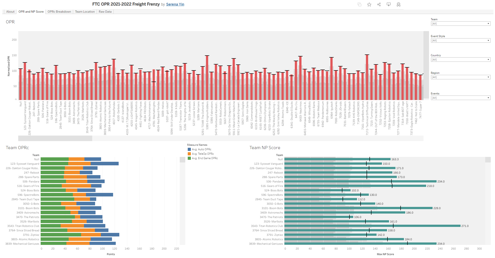

## FTC OPR 2021- 2022 Freight Frenzy Dashboard

Alliance selection and strategy has long been an integral component of the FIRST Tech Challenge. Regardless of whether it is just discussing alliance strategy for a qualification match or alliance selection for elimination matches, understanding gaps in one’s own team as well as how those gaps can be bridged when working in conjunction with an alliance partner is crucial.

To help easily identify the strengths and weaknesses of each team, the following FTC OPR 2021-2022 Freight Frenzy Tableau Dashboard documents the Offensive Power Ranking of FTC Teams around the world.

To access dashboard, please click [here](https://public.tableau.com/app/profile/serena.yin/viz/FTCOPR2021-2022FreightFrenzy/About).

This dashboard serves to answer questions such as:

_Which team can score the most in the Autonomous, Tele-Op and End Game periods of a match?_

_Which team had the highest match score with no penalty?_

_What is a team’s average match score with no penalty?_

### Specifications
The data populated in this dashboard is pulled from [http://www.ftcstats.org/2022/index.html](http://www.ftcstats.org/2022/index.html)

The data is directly scraped from the web through Microsoft Excel’s data scraping capability. As such data is not automated nor live and is pulled periodically. To see when the data was last refreshed, please see the about page tab in the dashboard.

### Data Fields:

**OPR:** offensive power ranking that reveals how many points teams can score individually. You can also see more details here 

**OPRc:**  Similar to OPR but constraints are added as there is a maximum number of points that can be scored in each period of the game

**Normalized OPR/ Non-Penalty OPRc:** If available, this is the OPR/OPRc when all penalties are removed from matches. For 2021-2022 Freight Frenzy, Normalized OPR includes subtracted penalties.

**Auto, TeleOp, and End Game OPRc:** If available, this is the OPRc for each phase of matches as reported. Should sum to Non-Penalty OPRc. Note that some states like Florida combine TeleOp and End Game scores.

**NP Avg:** Team’s average score through all matches without penalties

**Max NP Score:** Team’s max alliance score through all matches without penalties.

To learn more about how OPR is calculated, please refer to the following resources:

[Offense Defense Ranking- Chief Delphi](https://www.chiefdelphi.com/t/offense-defense-rankings-for-1043-teams/71490/19)

[The Math Behind OPR- The Blue Alliance Blog](https://blog.thebluealliance.com/2017/10/05/the-math-behind-opr-an-introduction/)
